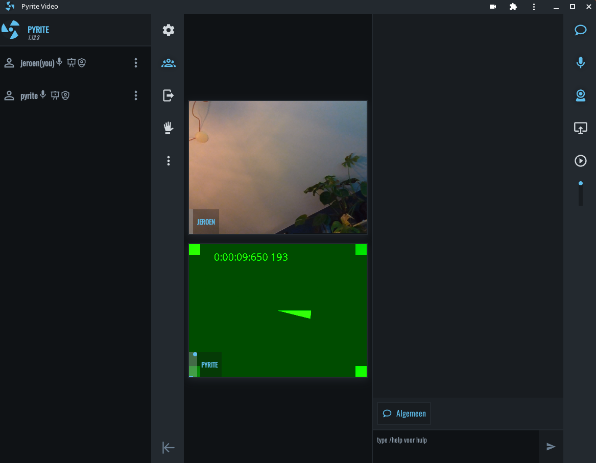

<br /><br />

<br />

[Galène](https://galene.org/) is a videoconference server (an “SFU”) that is easy
to deploy and that requires moderate server resources. [Pyrite](https://pyrite.video)
is an alternative web client and management interface for Galène, based on the
[Vue](https://v3.vuejs.org/) framework. Checkout Pyrite's [features](./docs/features.md)
or read more about how to deploy Pyrite on a network [here](./docs/index.md).

# Getting Started

```bash
git clone https://github.com/garage44/pyrite
cd pyrite/docker
id # Find out your host user/group id; used to keep volume permissions sane
PYRITE_UID=1000 PYRITE_GID=1000 docker-compose up
```

* Open a browser: <http://localhost:3030> :tada:
* Click on the logo to switch to admin modus
* Login with the credentials listed in the pyrite logger

## Manual Installation

```bash
git clone https://github.com/jech/galene
cd galene
git checkout galene-0.5.1
CGO_ENABLED=0 go build -ldflags='-s -w'
mkdir -p {data,groups,recordings}
./galene --insecure
```

```bash
# Use the published version:
npx @garage44/pyrite:latest
# Or manually run the dev-stack:
git clone https://github.com/garage44/pyrite
cd pyrite
npm install
npm run dev  # vitejs dev-service: http://localhost:3000
nodemon admin/app.js  # Express backend: http://localhost:3030
```

<p float="left">
    
    
</p>
